# Projeto iFOOD POO

## Descrição do Projeto

Este projeto é uma simulação do iFood utilizando conceitos de **Programação Orientada a Objetos (POO)** em Java, com persistência de dados em banco MySQL.  

O sistema possui três tipos de usuários: **Cliente**, **Restaurante** e **SuperAdmin**, permitindo cadastros, login, pedidos, favoritos e gerenciamento de produtos e restaurantes.

---

## Pré-requisitos

- Java 21 ou superior
- MySQL 8 ou superior
- IDE IntelliJ IDEA (ou outra de preferência)
- Maven (para gerenciamento de dependências, se utilizado)

---

## Download do Banco de Dados

O banco de dados já está pronto para uso. Você pode baixá-lo clicando no link:
   [Download do Banco de Dados](https://github.com/caioxdev/Projeto-Ifood-POO/releases/download/v1.0/projeto_ifood.sql)

--- 

### Instruções de Importação

1. Abra o **phpMyAdmin** ou **MySQL Workbench**.
2. Crie um banco de dados chamado `projeto_ifood`.
3. Importe o arquivo `projeto_ifood.sql`.
4. Verifique se todas as tabelas foram criadas: `cliente`, `restaurante`, `produto`, `pedido`, `itens_pedido`, `superadmin`, `favoritos`, `categoria`.

---

## Configuração do Projeto

1. Clone este repositório.

```bash
git clone https://github.com/caioxdev/Projeto-Ifood-POO.git
```
2. Abra o projeto na sua IDE Java.

3. Configure o arquivo `Conexao.java` com os dados do seu MySQL:

```java
private static final String URL = "jdbc:mysql://localhost:3306/projeto_ifood";
private static final String USER = "seu_usuario";
private static final String PASSWORD = "sua_senha";
```

4. Certifique-se de ter o **driver JDBC** do MySQL adicionar ao projeto (mysql-connector-j-x.x.x.jar).

---

## Como executar

1. Compile o projeto
2. Execute o ```App.java```.
3. No terminal, siga o menu principal:

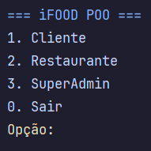

---

## Conceitos de POO Utilizados

- **Encapsulamento:** Todos os atributos das classes estão privados, com getters e setters.

- **Abstração:** Separação clara entre camadas: model, controller, view e dao.

- **Polimorfismo:** Métodos sobrecarregados (ex.: atualizar métodos) e uso de interfaces para DAOs.

- **Modularização:** Cada entidade (Cliente, Restaurante, Produto, Pedido, SuperAdmin) possui sua própria classe e DAO, facilitando manutenção.

- **Persistência:** Uso de JDBC para conectar e manipular dados no banco MySQL.

---

## Fluxos para Testes

### 1. Cliente

- **Cadastro:**
   - Menu Cliente -> 1. Cadastrar.
   - Inserir nome, email e senha.
- **Login:**
  - Menu Cliente -> 2. Login.
  - Inserir email e senha.
- **Fazer pedido:**
  - Menu Cliente -> 1. Fazer pedido.
  - Escolher restaurante pelo ID.
  - Selecionar produtos e quantidades.
- **Listar pedidos:** 
  - Menu Cliente -> 2. Listar pedidos.
- **Gerenciar Favoritos:** 
  - Menu Cliente -> 3. Favoritos.
  - Adicionar ou remover restaurantes favoritos.

### 2. Restaurante

- **Cadastro:**
  - Menu Restaurante -> 1. Cadastrar restaurante
  - Inserir nome, telefone, endereço e categoria.
  >🔹 **Atenção:** Para criar um restaurante, é necessário que uma categoria já esteja cadastrada no SuperAdmin..
- **Login:**
    - Menu Restaurante -> 2. Login.
    - Inserir ID do restaurante.
- **Gerenciar Produtos:**
  - Cadastrar produtos (nome, descrição, quantidade, preço).
  - Listar produtos cadastrados.
- **Atualizar Restaurantes:** Alterar dados do restaurante.
- **Remover Restaurantes:** Remover restaurantes do sistema.
- **SuperAdmin:**
  - Cadastro: Menu SuperAdmin -> 1. Cadastrar SuperAdmin.
    - Inserir nome, email, senha e telefone.
- **Login:**
  - Menu SuperAdmin -> 2. Login.
    - Inserir email e senha.
- **Gerenciamento:** 
  - Gerenciar categorias, restaurantes e produtos.
  - Acompanhar pedidos.

### Exemplos de IDs e Senhas para Teste

```txt
• Cliente
  - Nome: Caio.
  - Email: caio@gmail.com.
  - Senha: 1234.
• Restaurante
  - Nome: Lanchonete BomPreço.
  - Telefone: 61 25252525252.
  - Endereço: QNR 1 CONJ A 14.
  - ID: 17.
• SuperAdmin
  - Nome: Admin.
  - Email: admin@gmail.com.
  - Senha: 1234.
```

>🔹 Observação: A aplicação já existe tudo necessário para teste. **O que pode testar do zero: fazer uma compra e favoritar restaurantes.**

---

## Fluxo de Compra

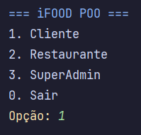

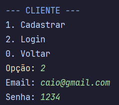

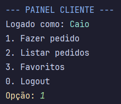

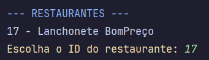

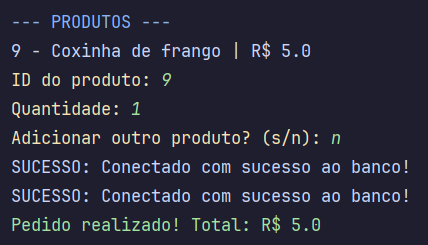

## Fluxo de favoritar restaurantes


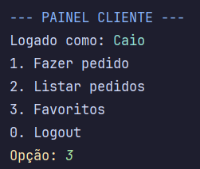

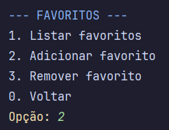

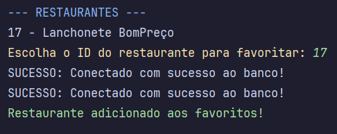

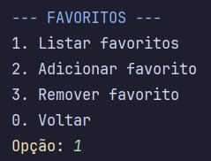

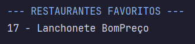

---

## Conclusão

- O projeto persiste dados em **MySQL.**
- As cores **ANSI** foram aplicadas para facilitar visualização no terminal.
- Base de referência: projeto **Lojinha** feito pelo professor da disciplina de POO.
- É possível criar novos Clientes, Restaurantes e SuperAdmin, mas lembre-se que para criar um restaurante é necessário ter uma categoria cadastrada.